# Experiment of MLP

[MLP](https://en.wikipedia.org/wiki/Multilayer_perceptron "MLP")
: Multilayer perception,

> A multilayer perceptron (MLP) is a fully connected class of feedforward artificial neural network (ANN). The term MLP is used ambiguously, sometimes loosely to mean any feedforward ANN, sometimes strictly to refer to networks composed of multiple layers of perceptrons (with threshold activation); see § Terminology. Multilayer perceptrons are sometimes colloquially referred to as "vanilla" neural networks, especially when they have a single hidden layer.[1]

I will make some experiment about it.

The github repo is established in
https://github.com/listenzcc/MLP-notebook/settings/pages

The formatted page is established in
https://listenzcc.github.io/MLP-notebook/

---

- [Experiment of MLP](#experiment-of-mlp)
  - [Experiment-6](#experiment-6)
  - [Experiment-5](#experiment-5)
  - [Experiment-4](#experiment-4)
  - [Experiment-3](#experiment-3)
  - [Experiment-2](#experiment-2)
    - [MLP Improve](#mlp-improve)
  - [Experiment-1](#experiment-1)

## Experiment-6

机器学习难，难在观测到的数据稀疏，从稀疏数据中估计总体分布如隔岸观火，如隔靴搔痒，如雾里看花。因此，交叉验证方法能利用有限的数据对估计出的分类器进行辅助评价和验证。

本文的结果图为 3x2 的 6 宫格图，

- 顶部两张图分别代表真实分布和估计出的分布，它们越相似代表估计效果越好。
- 中间两张图分别代表训练集和验证集的分布，严格来说这种验证集的选择方式是相当理想的，因为它补全了训练集中没有观测到的位置，从而可以在训练过程之外，比较有效地对模型进行评价。
- 底部两张图分别代表损失函数在训练过程中的变化趋势，以及估计分布与真实分布之间的差异。我们主要关注损失函数，两条曲线分别是训练集的损失函数（红色）和验证集的损失函数（蓝色）。

从损失函数的变化规律可以看到，虽然训练集损失函数在训练过程中单调下降，但验证集的损失函数却呈现出两个截然不同的趋势。当训练效果较好时，验证集的损失函数同样单调下降。而训练效果不佳时，验证集的损失函数几乎呈现单调上升的趋势，这种现象表示 MLP 模型陷入了过拟合的尴尬境地，也就是说它的估计准确率必然不佳。

另外，从估计结果来看，本文使用的分布函数对于如此小规模的 MLP 来说过于复杂了，但我觉得这种复杂度对于说明验证集的作用是比较合适的。

## Experiment-5

It is the complex system,
the target value is the radian of the complex number.
The ground truth of the regression is drawn as the following.

<!-- 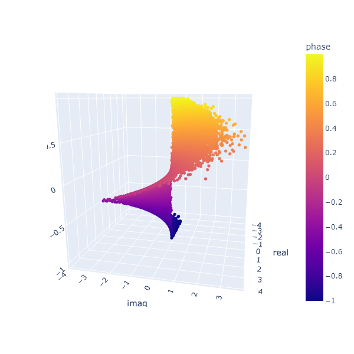 -->
<!-- 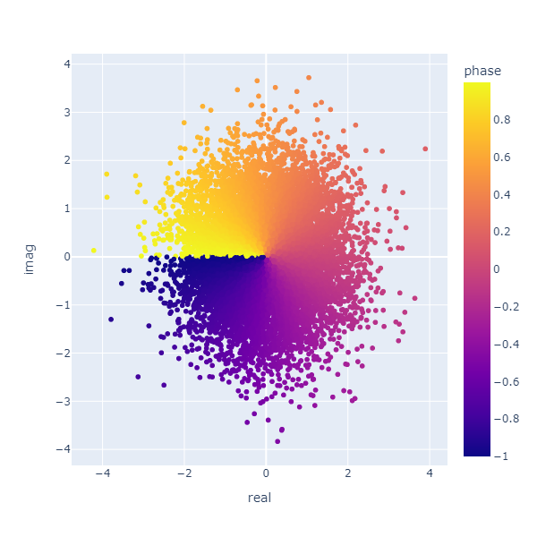 -->

<div>
<div style="display: flex; flex-wrap: wrap; gap: 20px">
</img>
</img>
</div>
</div>

It uses the MLP estimates the phase from complex numbers.

$$
\begin{cases}
 i^2 &= -1 \\
 c &= a + i \cdot b \\
 abs(c) &= \sqrt{c \cdot \hat{c}} \\
 phase(c) &= arctan(\frac{b}{a})
\end{cases}
$$

The MLP is deployed as

```
Net(
  (mlp): MLP(
    (0): Linear(in_features=2, out_features=4, bias=True)
    (1): LeakyReLU(negative_slope=0.01, inplace=True)
    (2): Dropout(p=0.0, inplace=True)
    (3): Linear(in_features=4, out_features=8, bias=True)
    (4): LeakyReLU(negative_slope=0.01, inplace=True)
    (5): Dropout(p=0.0, inplace=True)
    (6): Linear(in_features=8, out_features=4, bias=True)
    (7): LeakyReLU(negative_slope=0.01, inplace=True)
    (8): Dropout(p=0.0, inplace=True)
    (9): Linear(in_features=4, out_features=1, bias=True)
    (10): Dropout(p=0.0, inplace=True)
  )
  (sig): Tanh()
)
```

The output appears the MLP fails to estimate accurately.
The errors are distributed among the space,
and the jump part accounts for more error.

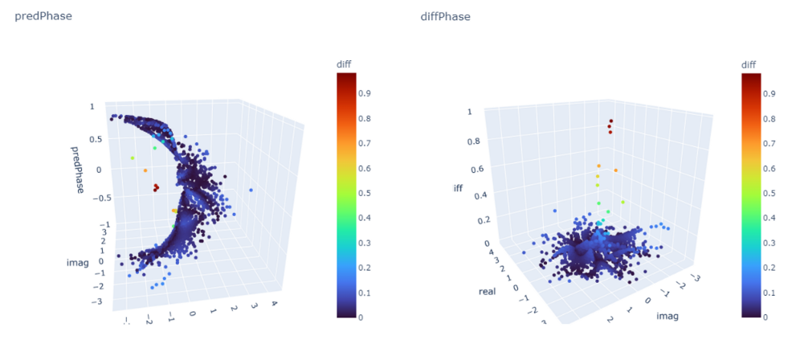

The histogram graph and error distribution are

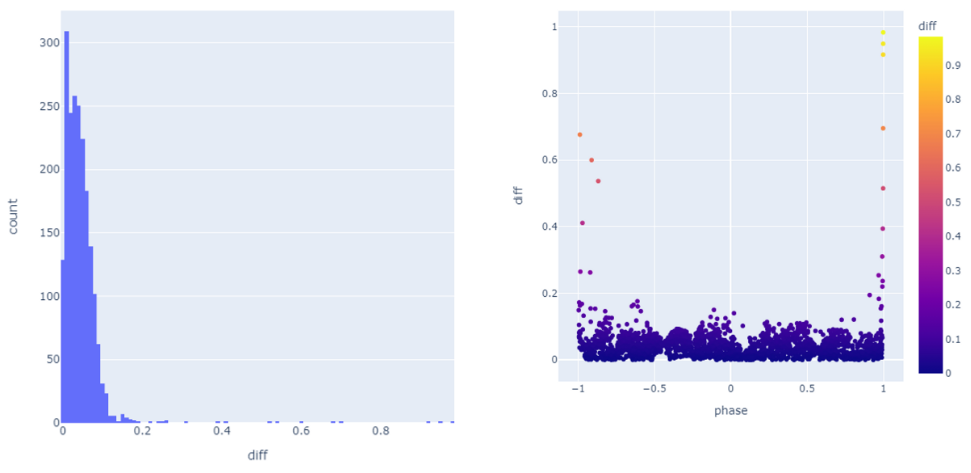

## Experiment-4

Trying to solve the problem of Maximized Posterior Probabilities Problem.

The MLP is not implemented yet.

The session is unfinished.

## Experiment-3

I reverse the radius parameter of the target curve in [experiment-3](experiment-3/main-3.py).
And the output is fine too.

```python
# src
theta = np.linspace(0, np.pi * 2, n)
r = np.linspace(0.2, 0.8, n)

# target
theta = np.linspace(0, np.pi * 6, n)
r = np.linspace(0.9, 0.1, n)
```

## Experiment-2

The experiment is performed based on experiment-1.
Firstly, I simplifies the dataset,
estimating a higher frequency spiral from a lower frequency spiral.

```python

# src
theta = np.linspace(0, np.pi * 2, n)
r = np.linspace(0.2, 0.8, n)

# target
theta = np.linspace(0, np.pi * 6, n)
r = np.linspace(0.1, 0.9, n)
```

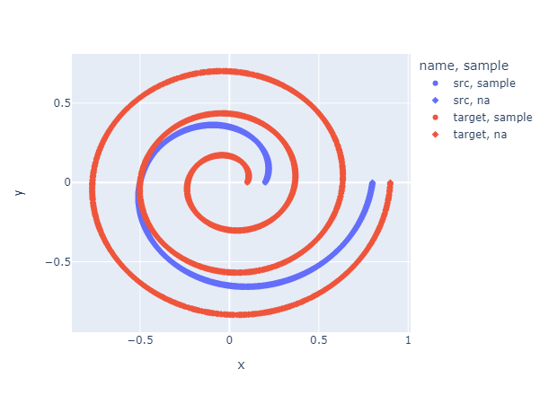

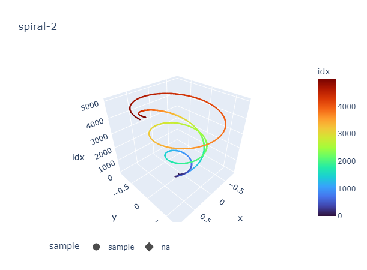

The training loss convergences, but the outcome is not satisfied.

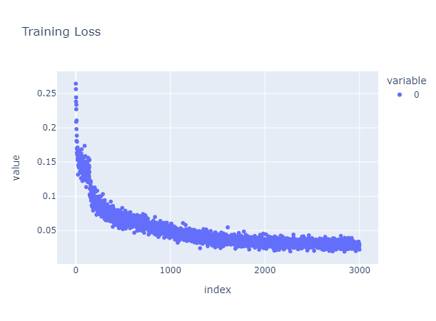
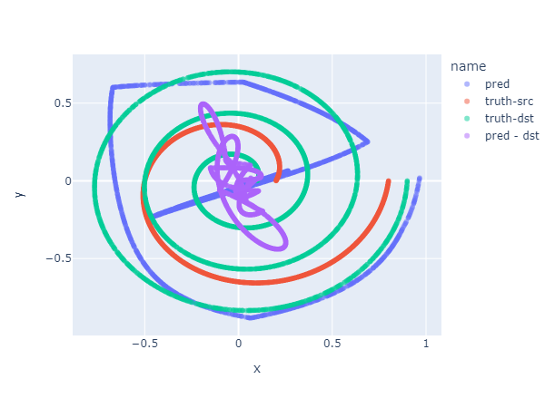
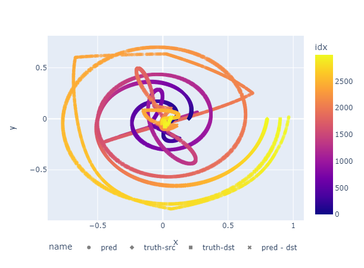

### MLP Improve

Then, I modifies the structure of the MLP network.
The new MLP contains one more layer.

```python
class Net(nn.Module):
    def __init__(self):
        super().__init__()
        self.mlp = torchvision.ops.MLP(
            2, [4, 8, 4, 2], activation_layer=nn.LeakyReLU)
        self.sig = nn.Tanh()

    def forward(self, x):
        return self.sig(self.mlp(x))
```

As it convergences, the output becomes also better

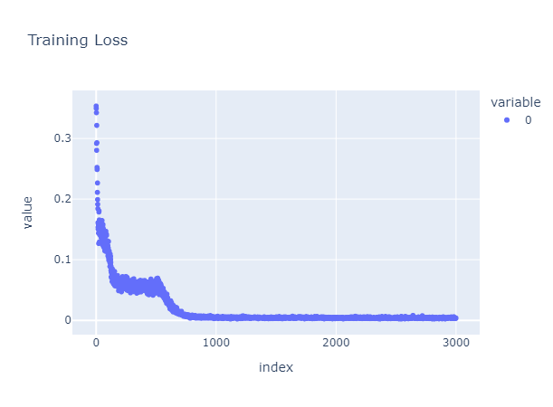
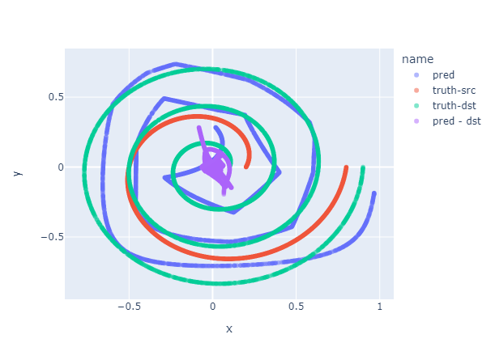

The outcome suggests the more potential variables, the more accuracy of the estimation,
Surprisingly, although there are more layers in the MLP, the faster it convergences with a lower loss value.
The interactive version is following.

<div>

<iframe src='./experiment-2/doc/spiral-1.html' style='width: 800px; height: 800px'></iframe>

<iframe src='./experiment-2/doc/spiral-2.html' style='width: 800px; height: 800px'></iframe>

<div>

---

## Experiment-1

The experiment is performed to test the edge of the MLP.

The spiral shaped point clouds are built,
and the MLP is used to predict one from another.

The dataset is generated by the script

```python

def mk_dataframe(x, y, r, theta, name='noname'):
    '''
    Make dataframe for the dataset
    '''
    df = pd.DataFrame()
    df['x'] = x
    df['y'] = y
    df['theta'] = theta
    df['r'] = r
    df['name'] = name
    df['idx'] = range(len(df))
    return df


n = 5000
m = 2000
sample = np.random.choice(range(n), m, replace=false)

# src
theta = np.linspace(0, np.pi * 5, n)
r = np.linspace(0.2, 0.8, n)
x = r * np.cos(theta)
y = r * np.sin(theta)
df1 = mk_dataframe(x, y, r, theta, 'src')
df1['sample'] = 'na'
df1.loc[sample, 'sample'] = 'sample'

# target
theta = np.linspace(0, np.pi * 6, n)
r = np.linspace(0.1, 0.9, n)
x = r * np.cos(theta)
y = r * np.sin(theta)
df2 = mk_dataframe(x, y, r, theta, 'target')
df2['sample'] = 'na'
df2.loc[sample, 'sample'] = 'sample'
```

Currently, in 20230101, the MLP estimates at a quite low accuracy.
The experiment code is provided in
[experiment-1/main.py](./experiment-1/main.py).

The MLP is built by torchvision,
and the learning process is defined as following.

It should be mentioned that I find the LeakyReLU prevents the model from crushing in many cases.

```python
class Net(nn.Module):
    def __init__(self):
        super().__init__()
        self.mlp = torchvision.ops.MLP(2, [4, 3, 2], activation_layer=nn.LeakyReLU)
        self.sig = nn.Tanh()

    def forward(self, x):
        return self.sig(self.mlp(x))


net = Net().cuda()

lr = 1e-2
optimizer = torch.optim.AdamW(net.parameters(), lr)
criterion = nn.MSELoss()
```

The model is trained for 1000 times,
and the outcome ends at

| Step  | Loss(train) | Loss(test) |
| :---: | :---------: | :--------: |
| 0960  |   0.0280    |   0.0251   |
| 0970  |   0.0213    |   0.0251   |
| 0980  |   0.0223    |   0.0251   |
| 0990  |   0.0234    |   0.0254   |

The dataset of the point clouds are presented in following,
it contains the 2D and 3D versions,
and the third dim of the 3D version are the order of the points.

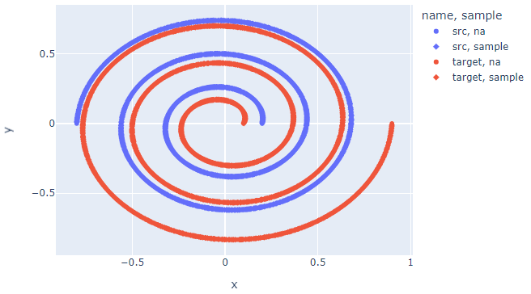

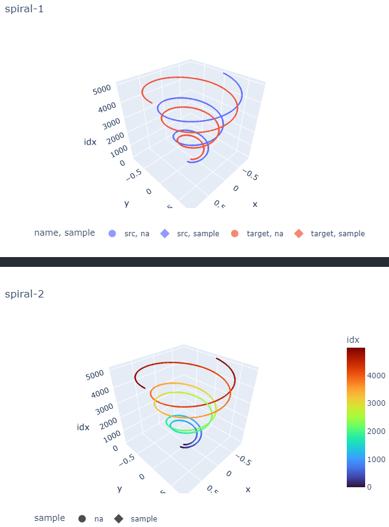

The outcome shows the prediction,
with a low accuracy.
The 2D and 3D versions are also provided.

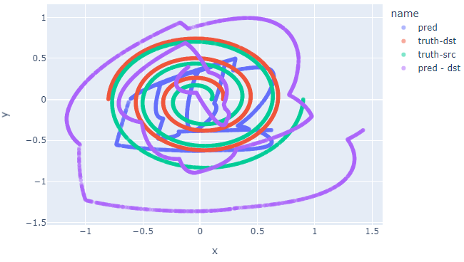

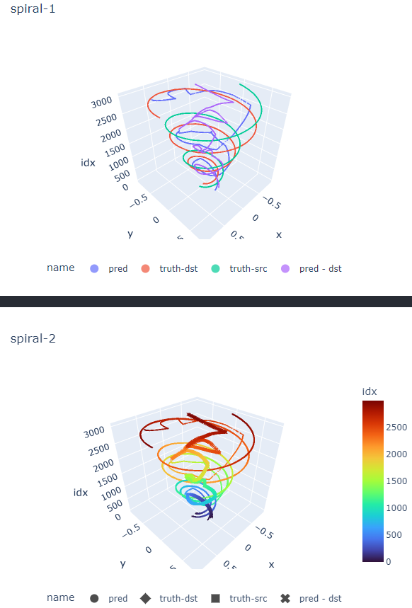

<div>

<iframe src='./experiment-1/doc/spiral-1.html' style='width: 800px; height: 800px'></iframe>

<iframe src='./experiment-1/doc/spiral-2.html' style='width: 800px; height: 800px'></iframe>

</div>
