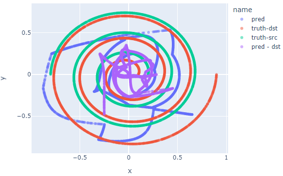

# Experiment of MLP

[MLP](https://en.wikipedia.org/wiki/Multilayer_perceptron "MLP")
: Multilayer perception,

>A multilayer perceptron (MLP) is a fully connected class of feedforward artificial neural network (ANN). The term MLP is used ambiguously, sometimes loosely to mean any feedforward ANN, sometimes strictly to refer to networks composed of multiple layers of perceptrons (with threshold activation); see § Terminology. Multilayer perceptrons are sometimes colloquially referred to as "vanilla" neural networks, especially when they have a single hidden layer.[1]

I will make some experiment about it.

The github repo is established in
https://github.com/listenzcc/MLP-notebook/settings/pages

The formatted page is established in
https://listenzcc.github.io/MLP-notebook/

---
- [Experiment of MLP](#experiment-of-mlp)
  - [Experiment-2](#experiment-2)
    - [MLP Improve](#mlp-improve)
  - [Experiment-1](#experiment-1)


## Experiment-2

The experiment is performed based on experiment-1.
Firstly, I simplifies the dataset,
estimating a higher frequency spiral from a lower frequency spiral. 

```python

# src
theta = np.linspace(0, np.pi * 2, n)
r = np.linspace(0.2, 0.8, n)

# target
theta = np.linspace(0, np.pi * 6, n)
r = np.linspace(0.1, 0.9, n)
```


The training loss convergences, but the outcome is not satisfied.


### MLP Improve

Then, I modifies the structure of the MLP network.
The new MLP contains one more layer.

```python
class Net(nn.Module):
    def __init__(self):
        super().__init__()
        self.mlp = torchvision.ops.MLP(
            2, [4, 8, 4, 2], activation_layer=nn.LeakyReLU)
        self.sig = nn.Tanh()

    def forward(self, x):
        return self.sig(self.mlp(x))
```

As it convergences, the output becomes also better


The outcome suggests the more potential variables, the more accuracy of the estimation,
Surprisingly, although there are more layers in the MLP, the faster it convergences with a lower loss value.
The interactive version is following.

<div>

<iframe src='./experiment-2/doc/spiral-1.html' style='width: 800px; height: 800px'></iframe>

<iframe src='./experiment-2/doc/spiral-2.html' style='width: 800px; height: 800px'></iframe>

<div>

---

## Experiment-1

The experiment is performed to test the edge of the MLP.

The spiral shaped point clouds are built,
and the MLP is used to predict one from another.

The dataset is generated by the script

```python

def mk_dataframe(x, y, r, theta, name='noname'):
    '''
    Make dataframe for the dataset
    '''
    df = pd.DataFrame()
    df['x'] = x
    df['y'] = y
    df['theta'] = theta
    df['r'] = r
    df['name'] = name
    df['idx'] = range(len(df))
    return df


n = 5000
m = 2000
sample = np.random.choice(range(n), m, replace=false)

# src
theta = np.linspace(0, np.pi * 5, n)
r = np.linspace(0.2, 0.8, n)
x = r * np.cos(theta)
y = r * np.sin(theta)
df1 = mk_dataframe(x, y, r, theta, 'src')
df1['sample'] = 'na'
df1.loc[sample, 'sample'] = 'sample'

# target
theta = np.linspace(0, np.pi * 6, n)
r = np.linspace(0.1, 0.9, n)
x = r * np.cos(theta)
y = r * np.sin(theta)
df2 = mk_dataframe(x, y, r, theta, 'target')
df2['sample'] = 'na'
df2.loc[sample, 'sample'] = 'sample'
```

Currently, in 20230101, the MLP estimates at a quite low accuracy.
The experiment code is provided in
[experiment-1/main.py](./experiment-1/main.py).

The MLP is built by torchvision,
and the learning process is defined as following.

It should be mentioned that I find the LeakyReLU prevents the model from crushing in many cases.

```python
class Net(nn.Module):
    def __init__(self):
        super().__init__()
        self.mlp = torchvision.ops.MLP(2, [4, 3, 2], activation_layer=nn.LeakyReLU)
        self.sig = nn.Tanh()

    def forward(self, x):
        return self.sig(self.mlp(x))


net = Net().cuda()

lr = 1e-2
optimizer = torch.optim.AdamW(net.parameters(), lr)
criterion = nn.MSELoss()
```

The model is trained for 1000 times,
and the outcome ends at

| Step  | Loss(train) | Loss(test) |
| :---: | :---------: | :--------: |
| 0960  |   0.0280    |   0.0251   |
| 0970  |   0.0213    |   0.0251   |
| 0980  |   0.0223    |   0.0251   |
| 0990  |   0.0234    |   0.0254   |

The dataset of the point clouds are presented in following,
it contains the 2D and 3D versions,
and the third dim of the 3D version are the order of the points.


The outcome shows the prediction,
with a low accuracy.
The 2D and 3D versions are also provided.




<div>

<iframe src='./experiment-1/doc/spiral-1.html' style='width: 800px; height: 800px'></iframe>

<iframe src='./experiment-1/doc/spiral-2.html' style='width: 800px; height: 800px'></iframe>

<div>